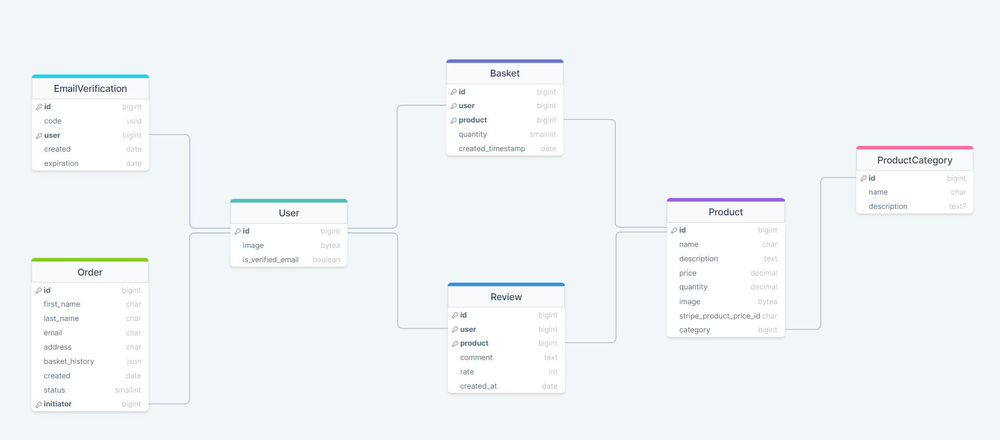
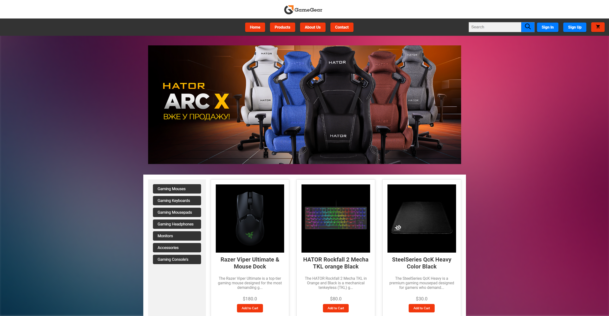
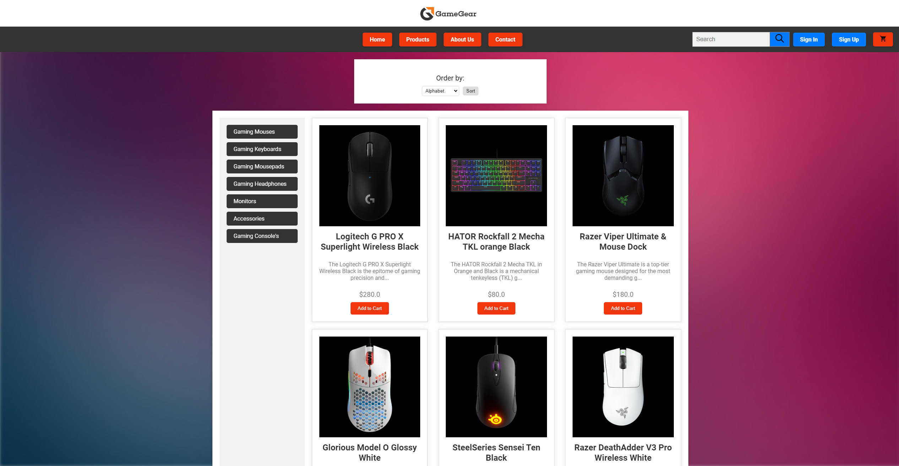
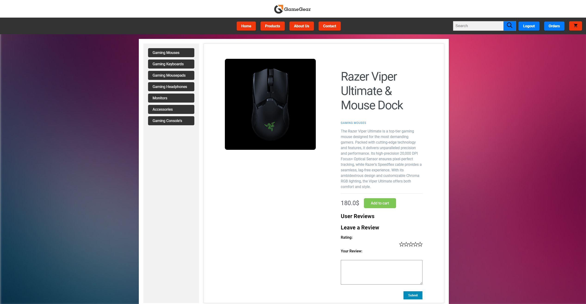
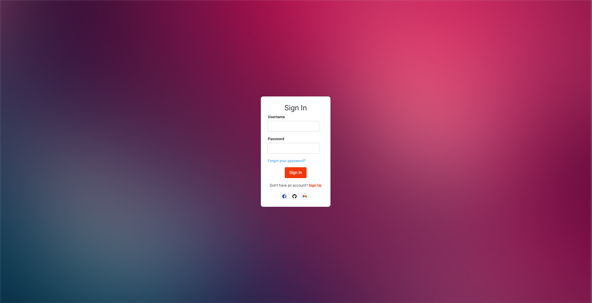
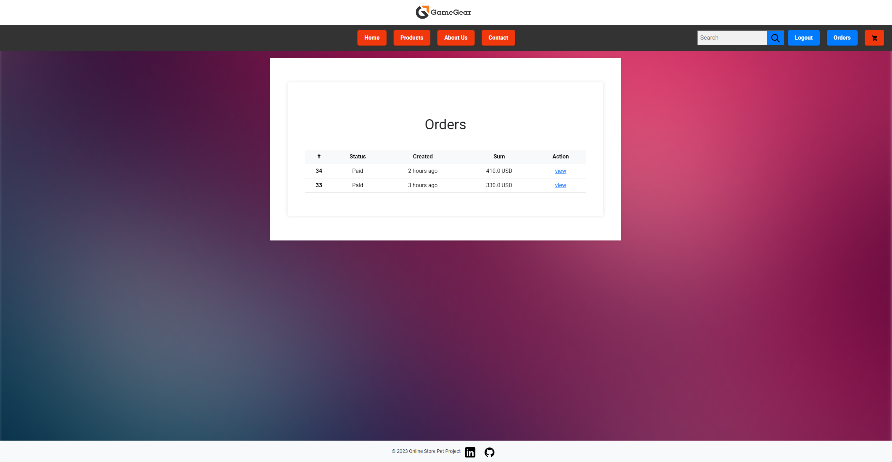

# GameGear Website
---
This project was initiated for educational purposes, with the primary objective 
being to delve deeper into technologies such as Django, PostgreSQL, Redis, and various others

## Technology Stack
* Python/Django/Django-ORM
* PostgreSQL
* Redis
* Celery
* API
* HTML/CSS/Bootstrap

---
In this project we are using PostgreSQL as main Database, Redis for message broker, cache some data, 
Celery for delayed tasks, API there is using for OAuth 2.0 and Stripe

# Database(PostgreSQL)

---
Our project has 7 self-written models, and other django and OAuth models.

## User Model
The User model represents users of the application, storing essential user information such as usernames, 
email addresses, names, and account status. It plays a central role in authentication and user management.

## Product Model
The Product model represents items or products available in the application. It includes details like product name, 
description, category, price, and an image for product representation.

## ProductCategory Model
The ProductCategory model categorizes products into different groups or categories. It helps organize and 
classify products for easier navigation and search.

## Order Model
The Order model captures information about user orders, including the user who placed the order, the products 
included in the order, the order date, and the total amount for the order.

## EmailVerification Model
The EmailVerification model is responsible for managing email verification requests. It associates a unique token 
with a user, enabling them to verify their email address for account activation and security.

## Review Model
The Review model allows users to provide feedback and ratings for products. It records the user who wrote the 
review, the product being reviewed, the rating given, and any written comments or reviews.

## Basket Model
The Basket model represents a user's shopping basket or cart, containing the products they have selected for purchase. 
It helps users keep track of their selected items before checkout.

# Redis
---
In this project, Redis is used to cache product pages and categories on the website.

# Celery
---
Celery was used for sending email verifications as delayed tasks to optimize this process. 

# Website Usage
---
## Langing Page

On this landing page, you can find current discounts and available stock. 
You have the options to sign in or sign up, navigate to the products page, or add products to your basket.
Additionally, you can see filtered categories and six products, with each product belonging to its respective category.
---

## Products Page

On the products page, we can see products, a right-side filtered categories, and a block for sorting by criteria.

There is a working pagination system, allowing us to view only six products per page.
Additionally, we can observe how the sorting feature functions. 

The search system, which also 
includes pagination and sorting options, is in operation.
---
## Product Page

On the product page, you can add products to the cart, read product descriptions, and write or read reviews.

Here we can see how to leave review with text and star ratings

## Users
### Login

On the login page, you can choose how you want to log in—either by using your created account or 
by using social networks such as GitHub, Facebook, or Gmail, it was made with using OAuth 2.0. 

### Login by Gmail

As wee see, there is login by using Gmail

### Sign In and verification

After a user signs in, an email verification message is sent to the email address associated 
with their registered account.

### Reset Password

If a user forgets their password, they can easily reset it by following the 'Forgot Password' process.

## Payment

In our Django project, we have seamlessly integrated Stripe as our preferred payment processing solution. 
Stripe offers a robust and developer-friendly platform that enhances the payment experience for our users 
while ensuring the highest standards of security. 

## Orders 

After we successfully make a payment, we can navigate to the orders page and view all of our orders,
including their status and total sum.

# Summary
This project represents a comprehensive exploration of web development using Django, encompassing a wide range of 
essential features and technologies. Through this journey, we delved into building a robust authentication system, 
enabling users to effortlessly sign in or sign up. Moreover, we embraced the power of third-party services like Gmail 
for user registration, offering a seamless onboarding experience.

Our project seamlessly integrates the Stripe payment system, ensuring secure and efficient payment processing on the 
website. We also harnessed the capabilities of Redis for data caching, optimizing performance and user experience. 
Celery was employed to manage delayed tasks, enhancing the project's responsiveness.

With an emphasis on user-friendly navigation, we extensively implemented pagination using Django's Paginator class. 
Additionally, we empowered users to search for products and sort them based on various criteria, further enhancing 
their interaction with the platform.

Overall, this project not only deepened our understanding of Django but also equipped us with practical skills in web
development, authentication, payment processing, caching, task management, and user experience optimization.

